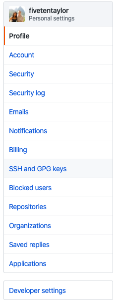
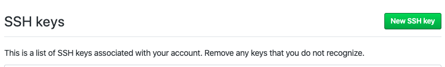

# Intro To Programming

Captures examples and students solutions throughout the course

## Setup pyenv

pyenv is a utility for managing multiple python installations on the same system

```
git clone https://github.com/pyenv/pyenv.git ~/.pyenv
echo 'export PYENV_ROOT="$HOME/.pyenv"' >> ~/.zshrc
echo 'export PATH="$PYENV_ROOT/bin:$PATH"' >> ~/.zshrc
echo -e 'if command -v pyenv 1>/dev/null 2>&1; then\n  eval "$(pyenv init -)"\nfi' >> ~/.zshrc
```

## Setup SSH Keys

How to generate a new ssh key pair to connect to github

```
ssh-keygen # press enter till success
cat ~/.ssh/id_rsa.pub | pbcopy
```

Login to your [github.com]() account and click on your account settings


Click on ssh and gpg keys



Add a new key


